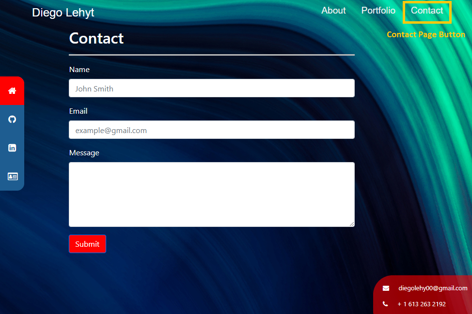

# Portfolio

# Instruction 

- Open URL at the end of this ReadMe file, (recomended Browser: Google Chrome).

# Buttons and pages

- Home Page.

- About me Page.

- Portfolio Page.

- Contact Page.

# Features

- Icon Side Bar

- Intro

- collapse Menu

- E-Mail and Cellphone

# Description

This Portafolio will run in the browser and feature dynamically updated HTML and CSS powered by JavaScript code. It also feature a clean and polished user interface and is responsive, ensuring that it adapts to multiple screen sizes.
like: CellPhones "640px", Tablets "768px", and Laptops "980px".

# Details

This repository content the html files: index "main page", about "about me page", portfolio "portfolio page", contact "contact page", the CSS styles "style.css", the JavaScript "script.js" and a "image" folder with the captures for this Readme File.

# URL 

The URL to open the page on your Browser is "https://diegolehyt.github.io/Portfolio/"